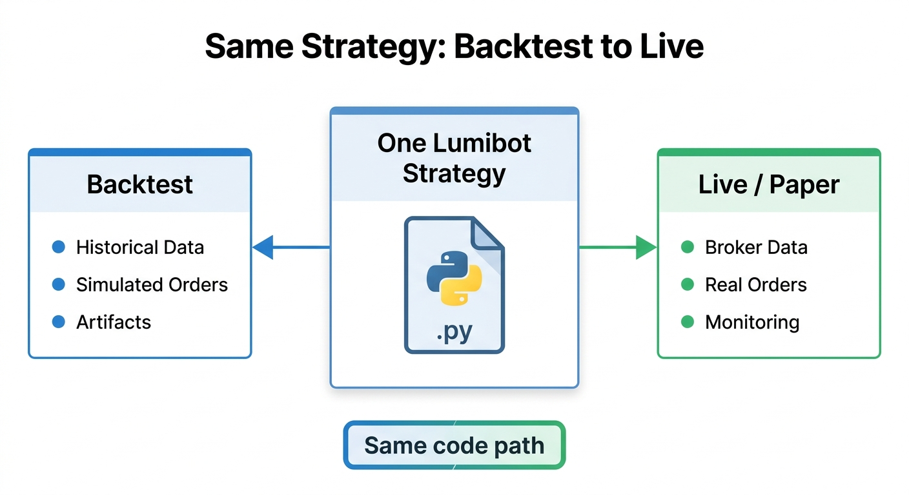
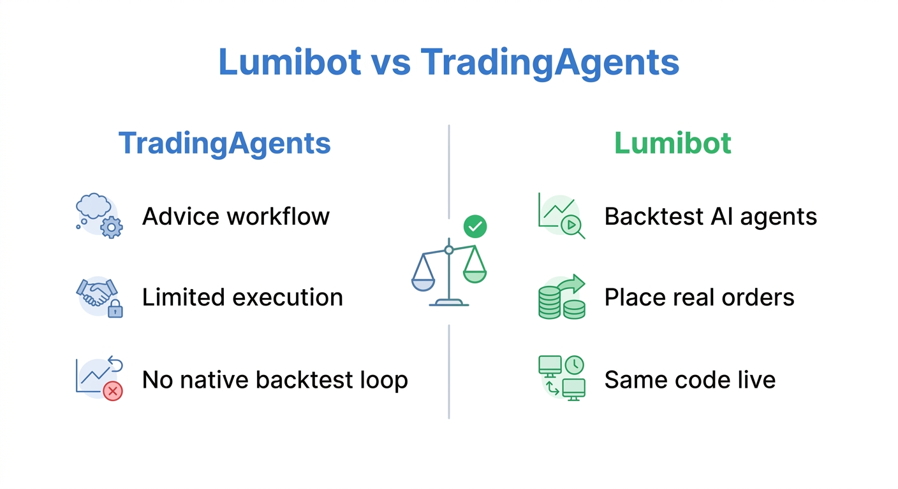
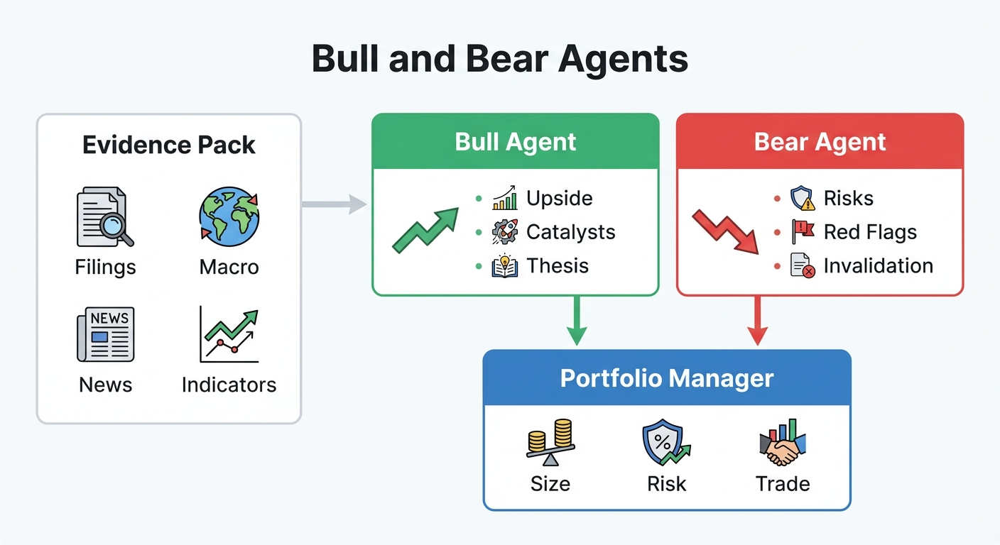
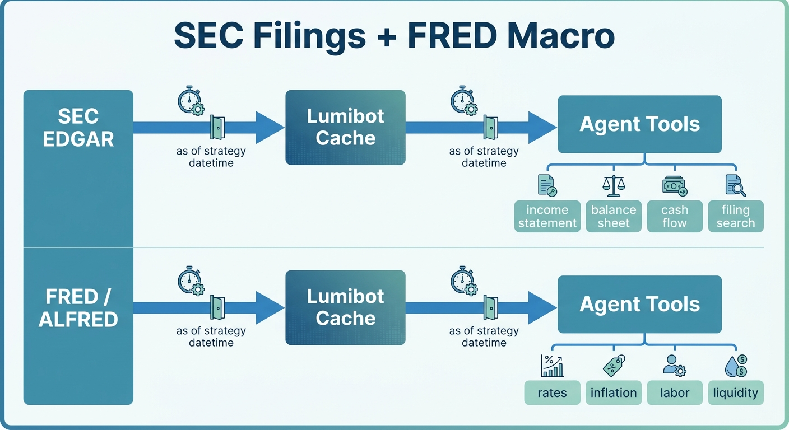
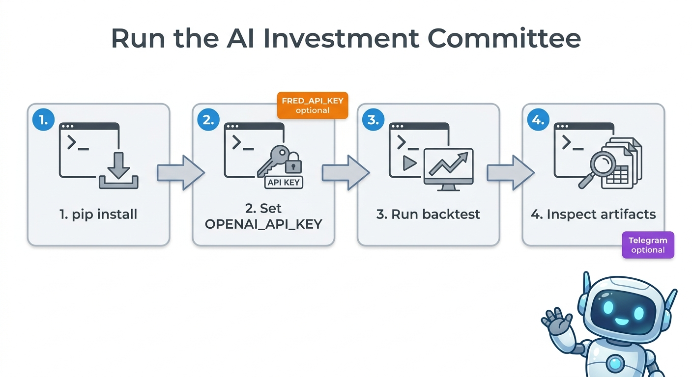
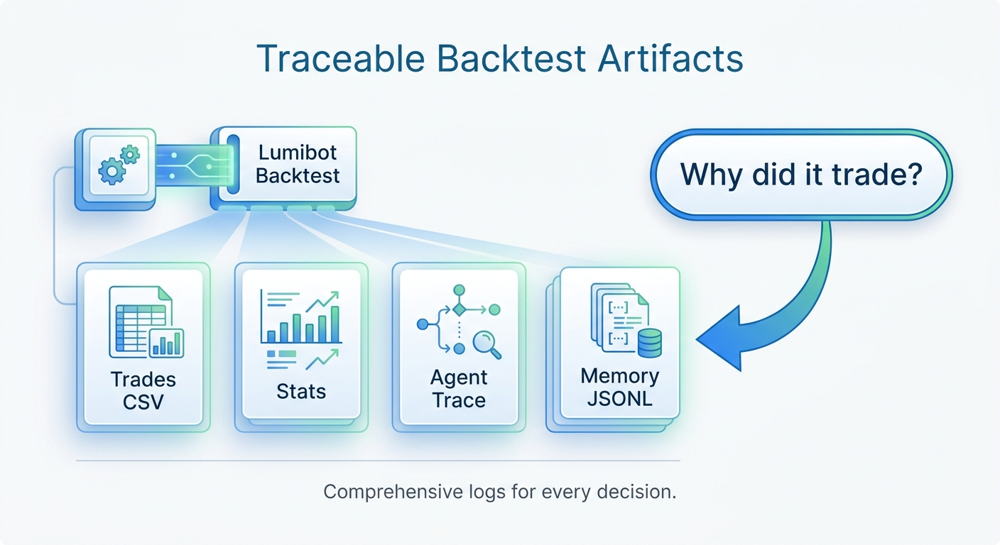
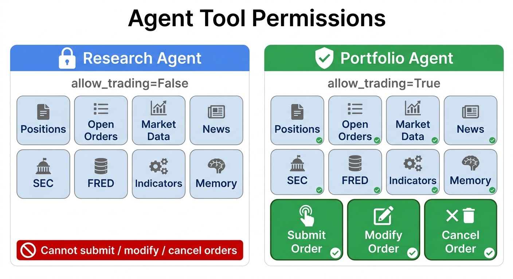

# Lumibot AI Investment Committee

Research, debate, backtest, explain, and execute real Lumibot strategies with a plain-Python multi-agent workflow.


This repository is a focused example built on top of [Lumibot](https://github.com/Lumiwealth/lumibot). It shows how to create an AI investment committee without LangGraph:

1. Evidence researcher gathers market data, indicators, news, SEC fundamentals, SEC filings, and FRED macro data.
2. Bull researcher builds the strongest long-only case.
3. Bear researcher attacks the trade and identifies risks.
4. Portfolio manager checks risk limits and places Lumibot orders only when the evidence is good enough.


## Why This Is Different

Most AI trading demos stop at advice. Lumibot agents run inside the same strategy lifecycle used for backtesting, paper trading, and live execution. The same code can analyze point-in-time evidence during a backtest and then place real broker orders when deployed.





## Evidence Pack

The research role is explicitly prompted to gather:

- Current prices and visible historical market data.
- Technical indicators such as RSI, MACD, moving averages, ATR, and trend context.
- Recent Alpaca/Benzinga news when Alpaca credentials are configured.
- SEC income statement, balance sheet, cash flow, and company facts.
- SEC filing lists and targeted filing search.
- FRED macro series such as rates, inflation, labor, growth, liquidity, and credit spreads.


## Bull And Bear Debate

The bull and bear agents receive the same evidence pack and can call read-only tools to dig deeper. The portfolio manager receives both cases before making a decision.




## SEC Fundamentals

SEC fundamentals use public SEC EDGAR APIs directly, require no API key, and are cached locally. Backtests are gated by filed date or acceptance timestamp so the agent does not see future filings.



## FRED Macro Data

FRED macro tools are built into Lumibot agents. They work with curated public CSV series by default and use `FRED_API_KEY` for official FRED/ALFRED vintage observations when you need stricter point-in-time macro backtests.

## Memory And Notifications

Lumibot includes local JSONL memory for decisions, lessons, and theses. Telegram notifications can be enabled when you want a bot to send decision summaries.


## Quick Start



```bash
python -m venv .venv
source .venv/bin/activate
pip install -r requirements.txt
cp .env.example .env
```

Set `OPENAI_API_KEY` in `.env`, then run:

```bash
python scripts/run_committee_backtest.py
```

The script writes results under `artifacts/ai_committee_real_backtests/`.

The default benchmark window is `2026-03-29` to `2026-04-29`, matching the BotSpot comparison runs used for Gemini, Claude, GPT, and Grok news-enabled strategies.

For local Lumibot development, keep this repository next to `/Users/robertgrzesik/Development/lumibot` or install your Lumibot checkout:

```bash
pip install -e ../lumibot
```

To run the deterministic no-LLM smoke wrapper against a sibling Lumibot checkout:

```bash
python scripts/run_deterministic_smoke.py
```



## Models

Each role can use a different model:

```bash
COMMITTEE_RESEARCH_MODEL=openai/gpt-5.4-mini
COMMITTEE_BULL_MODEL=openai/gpt-5.5
COMMITTEE_BEAR_MODEL=openai/gpt-5.5
COMMITTEE_TRADER_MODEL=openai/gpt-5.5
```

Use a cheaper model for evidence gathering and a stronger model for adversarial reasoning and the final portfolio decision.

## Safety

Research, bull, and bear agents use `allow_trading=False`. They can inspect prices, indicators, SEC filings, FRED macro data, news, positions, open orders, and memory, but they cannot submit, cancel, or modify orders. The portfolio manager is the only trading-enabled role.



## Adapting To Paper Or Live Trading

Start with the backtest runner. Once the evidence, risk limits, and artifact review look sane, adapt the same `AIInvestmentCommitteeStrategy` to a paper broker using the normal Lumibot broker setup. Keep the research, bull, and bear agents read-only, and only enable trading for the final portfolio-manager agent.

Never run live trading until you have reviewed the orders and risk controls in paper trading.
