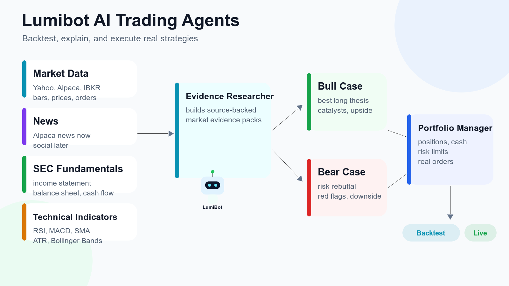
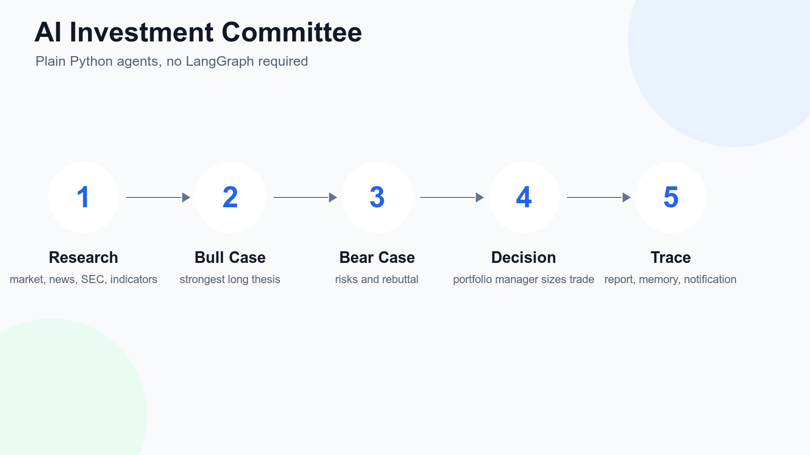
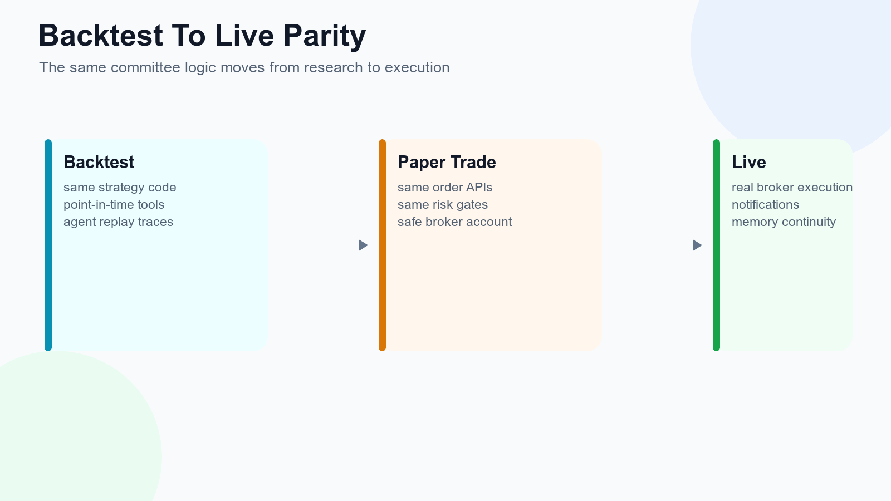
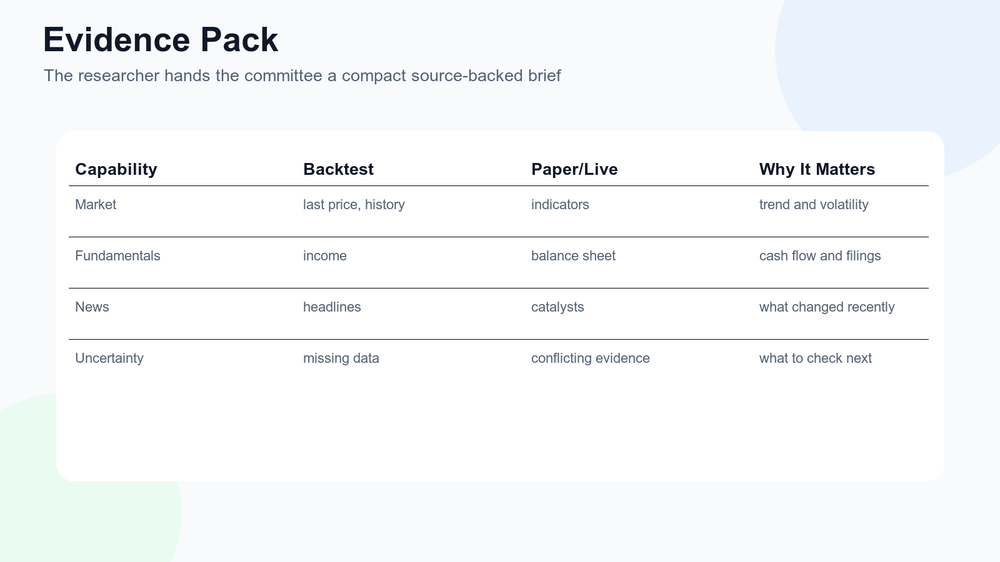
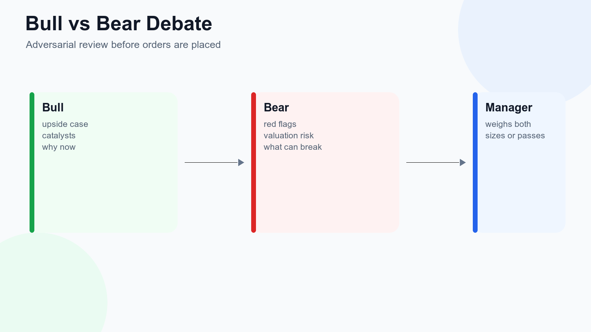
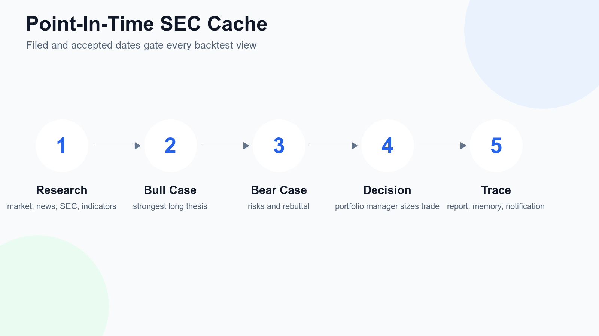
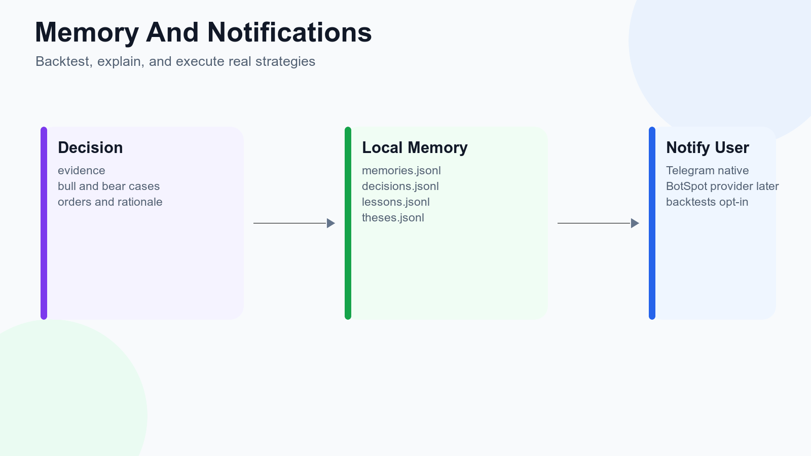
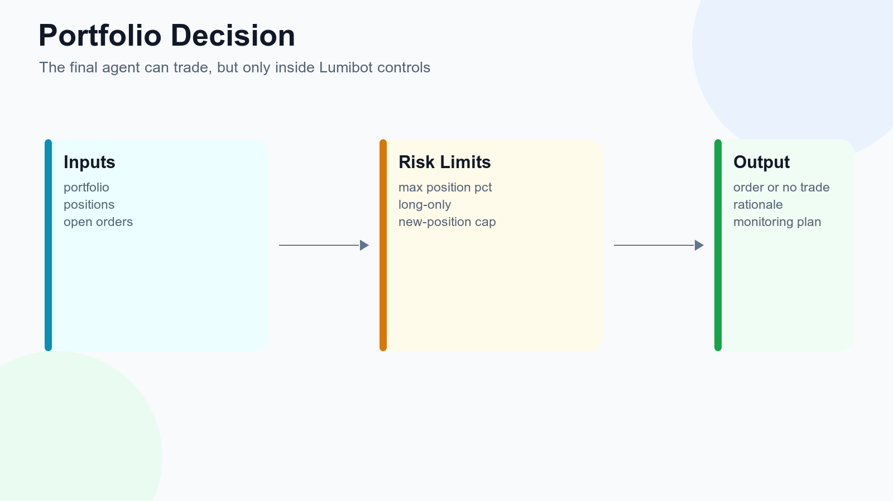

# Lumibot AI Investment Committee

Research, debate, backtest, explain, and execute real Lumibot strategies with a plain-Python multi-agent workflow.



This repository is a focused example built on top of [Lumibot](https://github.com/Lumiwealth/lumibot). It shows how to create an AI investment committee without LangGraph:

1. Evidence researcher gathers market data, indicators, news, SEC fundamentals, and SEC filings.
2. Bull researcher builds the strongest long-only case.
3. Bear researcher attacks the trade and identifies risks.
4. Portfolio manager checks risk limits and places Lumibot orders only when the evidence is good enough.



## Why This Is Different

Most AI trading demos stop at advice. Lumibot agents run inside the same strategy lifecycle used for backtesting, paper trading, and live execution. The same code can analyze point-in-time evidence during a backtest and then place real broker orders when deployed.



## Evidence Pack

The research role is explicitly prompted to gather:

- Current prices and visible historical market data.
- Technical indicators such as RSI, MACD, moving averages, ATR, and trend context.
- Recent Alpaca/Benzinga news when Alpaca credentials are configured.
- SEC income statement, balance sheet, cash flow, and company facts.
- SEC filing lists and targeted filing search.



## Bull And Bear Debate

The bull and bear agents receive the same evidence pack and can call read-only tools to dig deeper. The portfolio manager receives both cases before making a decision.



## SEC Fundamentals

SEC fundamentals use public SEC EDGAR APIs directly, require no API key, and are cached locally. Backtests are gated by filed date or acceptance timestamp so the agent does not see future filings.



## Memory And Notifications

Lumibot includes local JSONL memory for decisions, lessons, and theses. Telegram notifications can be enabled when you want a bot to send decision summaries.



## Quick Start

```bash
python -m venv .venv
source .venv/bin/activate
pip install -r requirements.txt
cp .env.example .env
```

Set `OPENAI_API_KEY` in `.env`, then run:

```bash
python scripts/run_committee_backtest.py
```

The script writes results under `artifacts/ai_committee_real_backtests/`.

## Models

Each role can use a different model:

```bash
COMMITTEE_RESEARCH_MODEL=openai/gpt-5.4-mini
COMMITTEE_BULL_MODEL=openai/gpt-5.5
COMMITTEE_BEAR_MODEL=openai/gpt-5.5
COMMITTEE_TRADER_MODEL=openai/gpt-5.5
```

Use a cheaper model for evidence gathering and a stronger model for adversarial reasoning and the final portfolio decision.

## Safety

Research, bull, and bear agents use `allow_trading=False`. They can inspect prices, indicators, SEC filings, news, positions, open orders, and memory, but they cannot submit, cancel, or modify orders. The portfolio manager is the only trading-enabled role.


